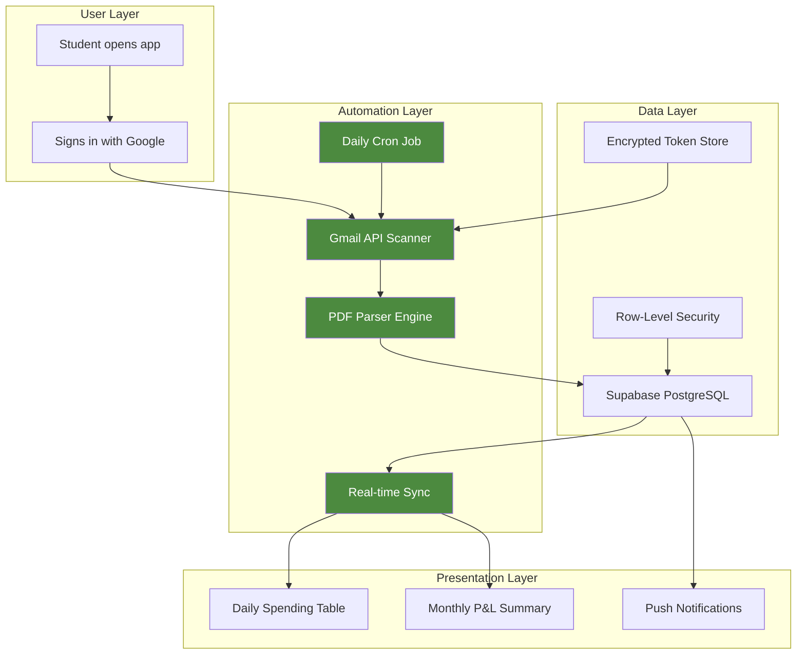
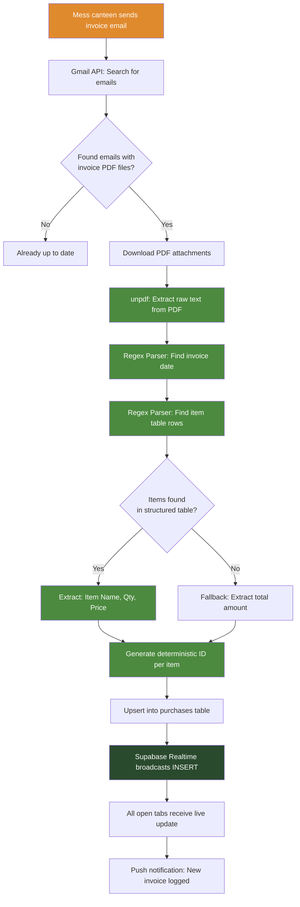
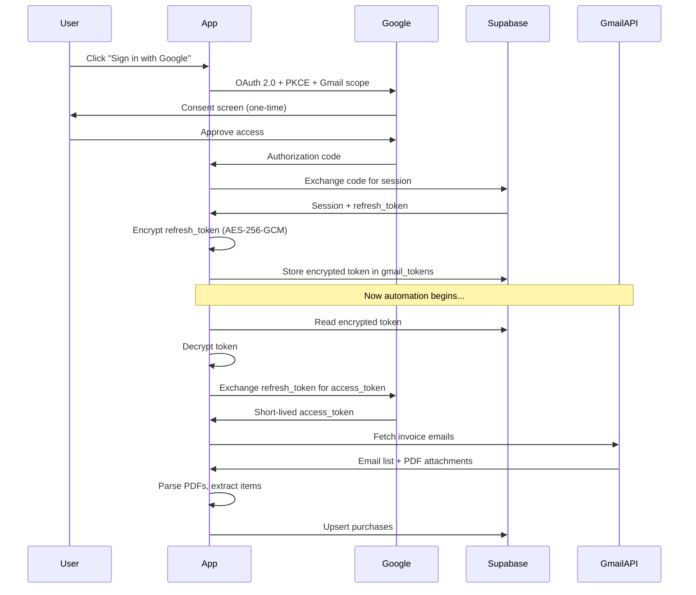
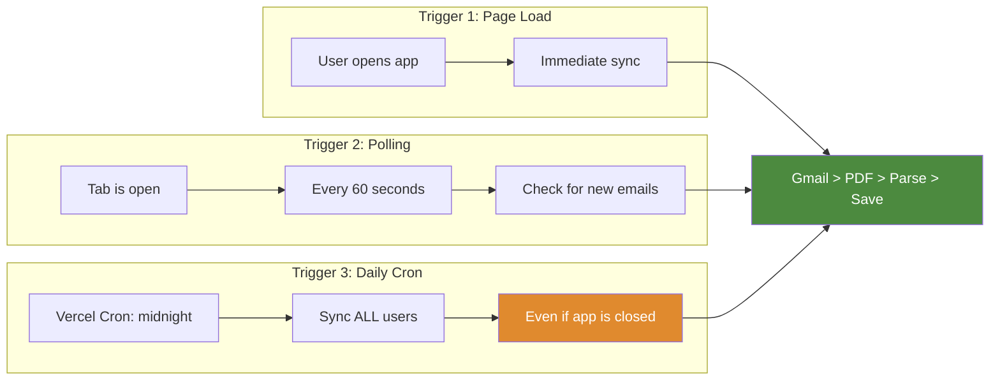
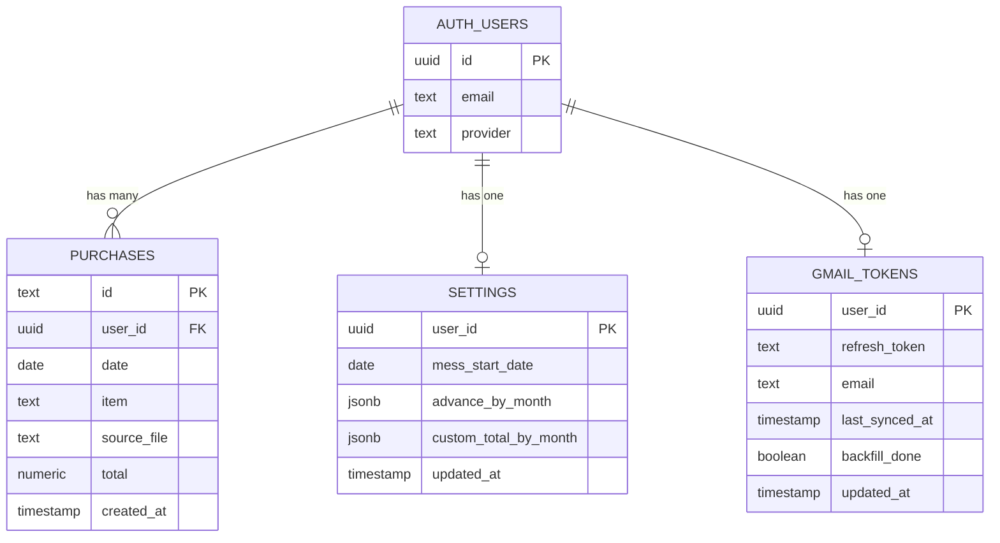
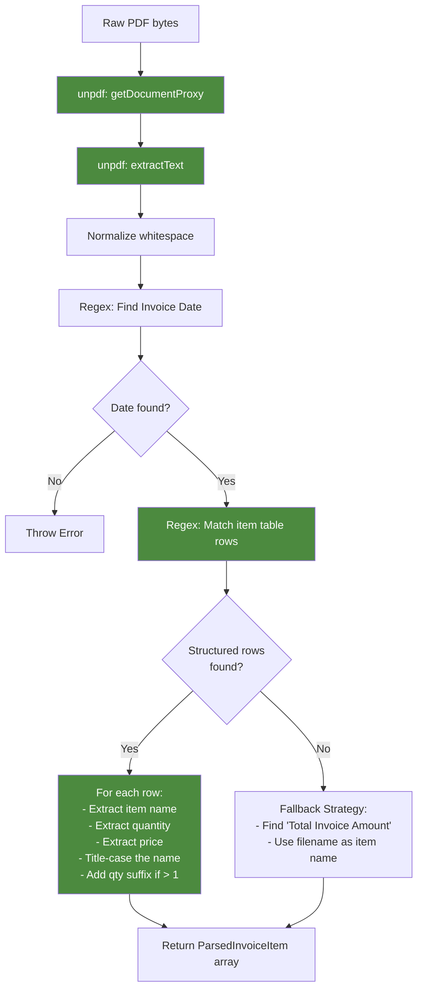
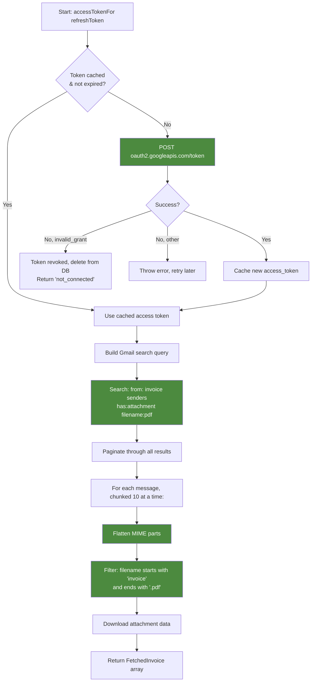
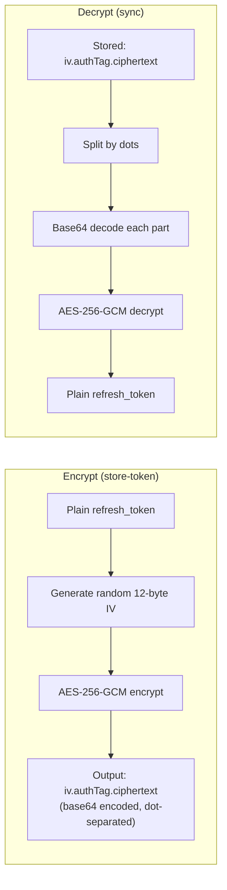
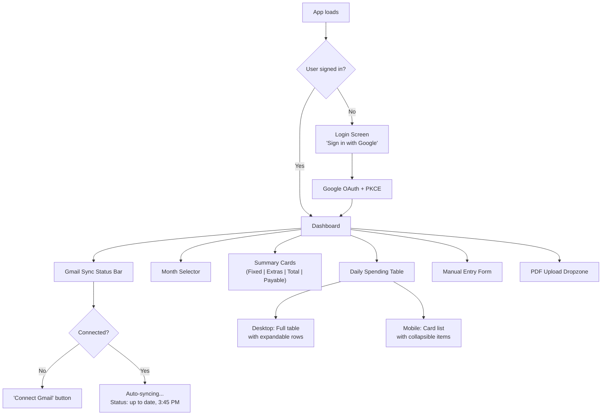
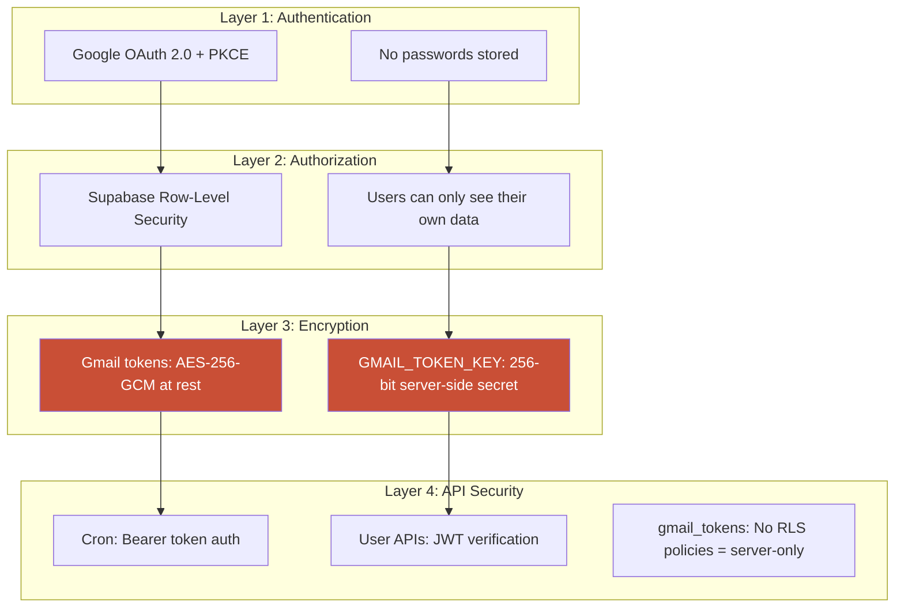

# Product Requirements Document (PRD)

## XIMB Mess Tracker - Automated Invoice Processing System

**Version:** 1.0
**Last Updated:** July 2026
**Status:** Production (Live)

---

## 1. Problem Statement

### The Pain 

Imagine you eat lunch and dinner at your school cafeteria every day. Every time you buy something extra (like a cold drink or snacks), they give you a little paper receipt.

At the end of the month\: **"How much did you spend?"**

Now you have to:

1. Find 30 emails with receipts
2. Open each PDF receipt one by one
3. Read every single item and price
4. Type it all into a spreadsheet
5. Add everything up
6. Subtract what you already paid

**That's exhausting. And boring. And you WILL make mistakes.**

### The Solution

**What if a bot did all of that for you?**

That's exactly what XIMB Mess Tracker does. You sign in once with Google, and the robot:

- Opens your email
- Finds the invoice PDFs
- Reads every item and price
- Saves it all
- Shows you a beautiful daily spending diary
- Does this every single day, automatically

**You do nothing. The bot does everything.**

---

## 2. Target Users

| User Type                     | Description                                     | Pain Level                                 |
| ----------------------------- | ----------------------------------------------- | ------------------------------------------ |
| **XIMB Students**       | ~500 students eating at the campus mess daily   | High - manual tracking takes 30+ min/month |
| **Mess Committee**      | Student body managing mess operations           | Medium - need aggregate spending data      |
| **Individual Trackers** | Students who want to budget their food spending | Low - want visibility, not just numbers    |

### User Persona

> **Aditya, 22, MBA Student at XIMB**
>
> "I get an invoice email every time I buy something extra at the mess. By month-end, I have 20-30 emails. I used to open each one, note down the amount, and add it up in my head. Half the time I'd forget or get the math wrong. Now I just open the app and everything's already there."

---

## 3. Automation Architecture

This is the core differentiator. **Everything is automated.** Here's the complete system:

### 3.1 High-Level System Architecture



### 3.2 The Automation Pipeline (Detailed Flow)

This is the step-by-step journey of an invoice from email to dashboard:



> **Green boxes = Automated by code (no human involved)**
>
> **Orange box = The only external trigger (an email arriving)**

### 3.3 Authentication & Security Flow



### 3.4 Three Sync Triggers

The automation doesn't just run once. It runs through **three different triggers**:



| Trigger               | When                | Who         | Why                                                          |
| --------------------- | ------------------- | ----------- | ------------------------------------------------------------ |
| **Page Load**   | User opens the app  | Single user | Catch up on any missed invoices                              |
| **60s Polling** | While tab is open   | Single user | Near-real-time for active users                              |
| **Daily Cron**  | Midnight, every day | ALL users   | Ensures nobody falls behind, even if they don't open the app |

---

## 4. Data Model

### 4.1 Entity Relationship Diagram



### 4.2 Table Details

#### `purchases` - Every food item you bought

| Column          | Type    | Description                                                                                             |
| --------------- | ------- | ------------------------------------------------------------------------------------------------------- |
| `id`          | TEXT    | Deterministic ID:`gm-{userId}-{msgId}-{attachIdx}-{itemIdx}` for Gmail items, UUID for manual entries |
| `user_id`     | UUID    | Who bought this                                                                                         |
| `date`        | DATE    | When they bought it                                                                                     |
| `item`        | TEXT    | What they bought (e.g., "Paneer Butter Masala (2)")                                                     |
| `source_file` | TEXT    | Which invoice PDF this came from                                                                        |
| `total`       | NUMERIC | How much it cost (Rs)                                                                                   |

> **Why deterministic IDs?** So the same invoice processed twice doesn't create duplicate entries. The ID is built from the Gmail message ID + attachment index + item index. This makes the entire pipeline **idempotent**. You can run it 100 times and get the same result.

#### `gmail_tokens` - Encrypted Gmail credentials

| Column             | Type        | Description                                |
| ------------------ | ----------- | ------------------------------------------ |
| `user_id`        | UUID        | Token owner                                |
| `refresh_token`  | TEXT        | AES-256-GCM encrypted Google refresh token |
| `last_synced_at` | TIMESTAMPTZ | Watermark for incremental sync             |
| `backfill_done`  | BOOLEAN     | Has the full history been scanned?         |

> **Security:** No RLS policies exist on this table. It has RLS enabled but zero policies. This means only the `SUPABASE_SERVICE_ROLE_KEY` (server-side) can read/write tokens. The browser client can never access them.

---

## 5. Automation Deep Dive

### 5.1 PDF Invoice Parsing Engine

The parser is the "brain" of the system. It takes raw PDF bytes and produces structured data.



**What the parser understands:**

```
Input PDF text (simplified):
"Invoice Date: 15-07-2026 ... 1 PANEER BUTTER MASALA 2 2.0PC ... 90.00 ... 2 COLD DRINK 1 1.0PC ... 30.00"

Output:
[
  { date: "2026-07-15", item: "Paneer Butter Masala (2)", total: 90.00 },
  { date: "2026-07-15", item: "Cold Drink", total: 30.00 }
]
```

### 5.2 Gmail Scanning Engine



**Search query used:**

```
from:(noreply@wepsol.com) has:attachment filename:pdf
```

**Rate limiting:** Messages are processed in chunks of 10 to stay under Gmail's per-user API quota.

### 5.3 Encryption System



**Why AES-256-GCM?**

- **AES-256** = Military-grade encryption (even governments use this)
- **GCM** = Also verifies the data wasn't tampered with (authentication tag)
- **Random IV** = Same token encrypted twice produces different output (prevents pattern analysis)

---

## 6. User Interface

### 6.1 Screen Flow



### 6.2 Key UI Components

| Component                | What It Shows                                      | Automation Role                     |
| ------------------------ | -------------------------------------------------- | ----------------------------------- |
| **Gmail Sync Bar** | Green/red dot, sync status, last sync time         | Shows automation is working         |
| **Summary Cards**  | Fixed total, variable total, grand total, payable  | Auto-calculated from synced data    |
| **Daily Table**    | Date, fixed cost, extras (expandable), daily total | Auto-populated from parsed invoices |
| **Month Selector** | Switch between months                              | Filters auto-synced data            |
| **Payable Bar**    | Final amount owed (total minus advance)            | The "answer", fully automated       |

---

## 7. Security Model

### 7.1 Defense in Depth



### 7.2 Key Security Decisions

| Decision                             | Rationale                                                                                |
| ------------------------------------ | ---------------------------------------------------------------------------------------- |
| **PKCE auth flow**             | Prevents authorization code interception attacks (no client_secret in browser)           |
| **Encrypted refresh tokens**   | Even if the database is breached, tokens are useless without the encryption key          |
| **Server-only token access**   | `gmail_tokens` table has RLS enabled with zero policies = browser JS can never read it |
| **Deterministic purchase IDs** | Prevents duplicate entries and makes the pipeline safely re-runnable                     |
| **1-hour sync overlap window** | Ensures no invoices are missed at sync boundaries                                        |

---

## 8. Automation Configurations

### 8.1 Vercel Cron Configuration

```json
{
  "crons": [
    {
      "path": "/api/gmail/sync-all",
      "schedule": "0 0 * * *"
    }
  ]
}
```

**Translation:** "Every day at midnight UTC, call the sync-all endpoint to process all connected users."

### 8.2 Invoice Sender Whitelist

```typescript
export const INVOICE_SENDERS = ["noreply@wepsol.com"];
```

Only emails from `noreply@wepsol.com` (the official canteen automated invoice sender) are scanned. This prevents the app from reading personal or unrelated emails.

### 8.3 Attachment Filter Rules

```
Accepted: invoice-july-2026.pdf, Invoice_15072026.pdf
Rejected: receipt.pdf, menu.pdf, photo.jpg
```

Rule: Filename must **start with "invoice"** AND **end with ".pdf"**.

---

## 9. Performance & Scalability

| Metric                      | Current                     | Design Limit                         |
| --------------------------- | --------------------------- | ------------------------------------ |
| **Users**             | 3 active                    | Unlimited (each syncs independently) |
| **Sync latency**      | ~2-5 seconds per user       | 60-second max duration (Vercel)      |
| **PDF parse time**    | ~200ms per invoice          | Serverless scales horizontally       |
| **Gmail API calls**   | Chunked (10 messages/batch) | Stays under per-user quota           |
| **Cron frequency**    | Daily (midnight UTC)        | Can increase to hourly if needed     |
| **Real-time updates** | ~100ms (Supabase Realtime)  | WebSocket, no polling                |

---

## 10. Future Roadmap

| Priority | Feature                            | Automation Level                                       |
| -------- | ---------------------------------- | ------------------------------------------------------ |
| P0       | **Multi-canteen support**    | Auto-detect canteen from invoice format                |
| P1       | **Spending insights**        | Auto-generated weekly spending summaries               |
| P1       | **Budget alerts**            | Auto-notify when spending exceeds threshold            |
| P2       | **WhatsApp sync**            | Parse invoices from WhatsApp messages                  |
| P2       | **Receipt OCR**              | Camera capture to OCR to auto-log (for paper receipts) |
| P3       | **Mess committee dashboard** | Aggregate analytics for mess management                |

---

## 11. Success Metrics

| Metric                     | Target                         | How We Measure                                    |
| -------------------------- | ------------------------------ | ------------------------------------------------- |
| **Zero-touch rate**  | >90% of purchases auto-logged  | `source_file LIKE 'invoice%'` / total purchases |
| **Sync reliability** | >99% daily cron success        | Vercel Cron logs                                  |
| **Time saved**       | 30+ min/month per user         | User survey                                       |
| **Parse accuracy**   | >95% items correctly extracted | Manual spot-checks                                |
| **Active users**     | 50+ monthly                    | PostHog analytics                                 |

---

## 12. Testing Strategy

| Layer              | What                                  | How                                          |
| ------------------ | ------------------------------------- | -------------------------------------------- |
| **Parser**   | Invoice PDF extraction accuracy       | Sample PDFs with known items, compare output |
| **Sync**     | End-to-end Gmail to DB pipeline       | Test accounts with known invoice emails      |
| **Auth**     | OAuth flow + token storage            | Manual browser testing                       |
| **Security** | Token encryption/decryption roundtrip | Unit test: encrypt then decrypt = original   |
| **Cron**     | Daily sync-all reliability            | Vercel Cron monitoring dashboard             |

---

<p align="center">
  <b>XIMB Mess Tracker. Because life's too short to count mess bills by hand.</b><br>
  <i>Automated. Zero effort.</i>
</p>
